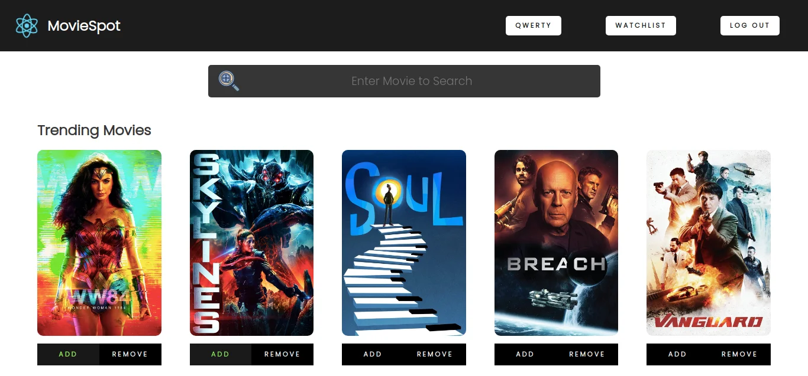

## MovieSpot

### React Movie Search Web Application using TMDB API

### Live Demo

[Click here to see it live](https://moviespot.netlify.app/)

[](https://user-images.githubusercontent.com/55753068/105644810-99f91580-5ebd-11eb-9e4f-7ba9abd4d7f8.mp4 "Click to Watch!")


## Installation

```
git clone https://github.com/neeraj1bh/MoviePost.git
cd [foldername]
npm install && npm run dev

```

## Features

- User can view Trending movies and Search for movies.
- View detailed summary for every movie.
- View entire cast for every movie.
- Also user can view some additional info like Budget, Revenue and Ratings.

## External Libraries

- [React Router Dom](https://github.com/ReactTraining/react-router/tree/master/packages/react-router-dom)
- [Styled Components](https://github.com/styled-components/styled-components)
- [Prop-Types](https://github.com/facebook/prop-types)

